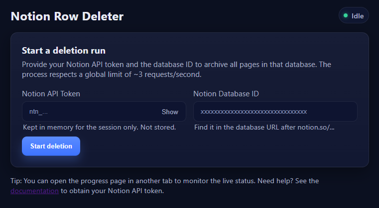
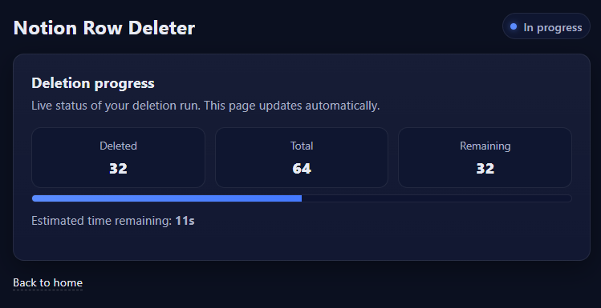

# Notion Row Deleter — Self-contained binary (local execution)

A simple tool to archive (soft-delete) all pages of a Notion database through a small local web UI. The intent is to run it on YOUR machine, not to deploy it on a server. This way, your Notion API token stays on your PC.

The binary is self-contained: the web UI and images are embedded into the executable. No installation or system dependencies are required. The app automatically opens your browser at http://localhost:8080 and only connects to `api.notion.com` to do its job.

If you just want to use the program, you can download it by clicking on the `<> Code` button and selecting "Download ZIP". Then, you can execute the programme `notion-row-deleter-main/dist/notion-row-deleter-windows-amd64.exe`

## Why local execution (not deployment)?
- Privacy: your Notion API token is entered in the local UI and never leaves your machine.
- Simplicity: a single binary to run; no server, no reverse proxy, no network setup.
- Robustness: no external storage; everything lives in memory for the duration of the run.

## Key features
- Archive all pages of a Notion database via the official API.
- Local web UI with real-time progress (WebSocket): deleted/total/ETA.
- Rate limiting: ~3 requests/sec globally; multi-worker pooling for good throughput.
- Self-contained binary: templates and images embedded (no separate assets).

## Quick start
1. Run the binary.
2. Your browser opens automatically at `http://localhost:8080`.
3. Enter your Notion API token and the Database ID (see the in-app “Docs” page for help).
4. Start the run and follow progress on the “Deleting” page (progress bar, remaining, ETA).
5. When done, just close the app; nothing is persisted.

Notes:
- Archiving uses `PATCH /v1/pages/{id}` with `{ "archived": true }`.
- A progress update is sent after each page is archived.

## Requirements and compatibility
- Platforms: Windows and Linux (amd64/arm64).
- Network: outbound access to `api.notion.com` (HTTPS).
- No other prerequisites (you don’t need Go, Node, etc. to use the binary).

## Build from source (optional)
If you prefer to compile it yourself:
- Host build: `make build` → produces `dist/notion-row-deleter`
- Cross-compile:
  - `make build-linux` (amd64/arm64)
  - `make build-windows` (amd64/arm64)
  - `make build-all` (Linux+Windows, amd64/arm64)

## Technical details (FYI)
- Local endpoints:
  - `GET /` – home page (form: token + database ID)
  - `POST /delete` – starts archiving in the background; redirects to `/deleting`
  - `GET /deleting` – real-time progress dashboard (WebSocket)
  - `GET /ws` – JSON stream `{ running, deleted, total, etaSeconds }`
- Behavior:
  - Only one run at a time (atomic lock).
  - Fully paginates first to compute the total, then archives.
  - Stops on the first Notion API error (no automatic retry/backoff).

## Security and privacy
- The token and database ID are never written to disk; they remain in memory during execution.
- No telemetry; only `api.notion.com` is contacted for the Notion API.
- Everything runs locally on `localhost:8080`.

## Troubleshooting
- No real-time updates:
  - Keep the “Deleting” page open and ensure the WebSocket connection is active (browser DevTools → Network).
  - Refresh the page if necessary.
- Notion 429/5xx errors:
  - Try again later; the global rate limit is respected but the API might temporarily reject requests.
- Nothing happens after submitting the form:
  - Check the token and database ID; also look at the application logs printed to the console.
